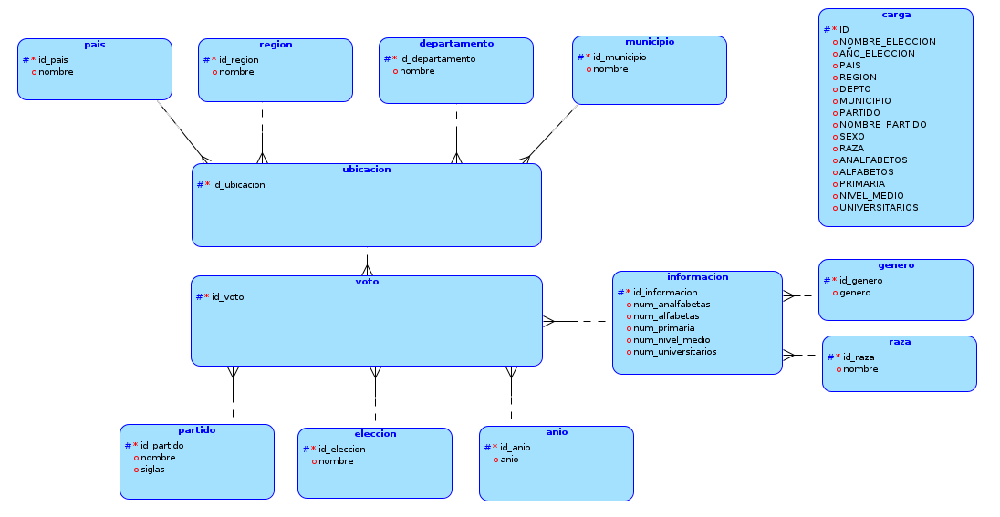
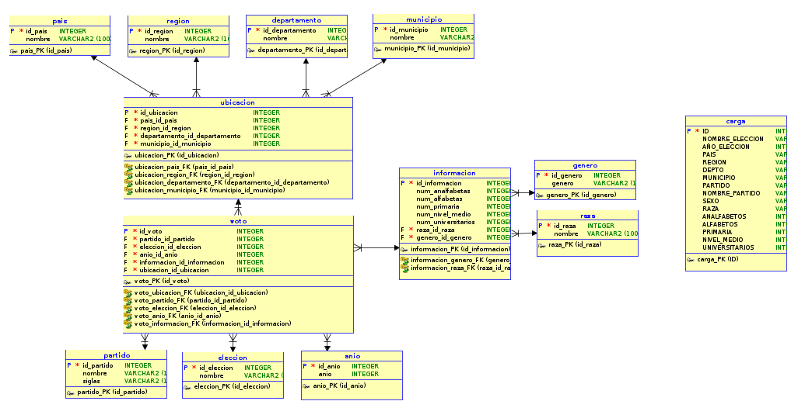

# Proyecto 2 SBD1, Grupo 14

| NOMBRE                         |  CARNET   |
| ------------------------------ | :-------: |
| Jeser Emanuel Rodas Medina     | 202105561 |
| Harry Aaron Gómez Sanic        | 202103718 |
| Anthony Samuel Zea Herrera     | 202104782 |
| Kevin Ernesto García Hernández | 202113553 |

 

## Modelos

### Modelo Lógico

### Modelo Físico

 

## Pasos la normalización.

1. Normalización de la tabla "pais":  
   Se insertan en la tabla "pais" todos los países únicos que aparecen en la tabla "carga".

2. Normalización de la tabla "region":  
   Se insertan en la tabla "region" todas las regiones únicas que aparecen en la tabla "carga".

3. Normalización de la tabla "departamento":  
   Se insertan en la tabla "departamento" todos los departamentos únicos que aparecen en la tabla "carga".

4. Normalización de la tabla "municipio":  
   Se insertan en la tabla "municipio" todos los municipios únicos que aparecen en la tabla "carga".

5. Normalización de la tabla "partido":  
   Se insertan en la tabla "partido" todos los nombres de partido únicos con sus respectivas siglas que aparecen en la tabla "carga".  
   Se eliminan los duplicados de partido, conservando solo el partido con el ID mínimo.

6. Normalización de la tabla "eleccion":  
   Se insertan en la tabla "eleccion" todos los nombres de elección únicos que aparecen en la tabla "carga".

7. Normalización de la tabla "anio":  
   Se insertan en la tabla "anio" todos los años únicos de elecciones que aparecen en la tabla "carga".

8. Normalización de la tabla "genero":  
   Se insertan en la tabla "genero" todos los géneros únicos que aparecen en la tabla "carga".

9. Normalización de la tabla "raza":  
   Se insertan en la tabla "raza" todas las razas únicas que aparecen en la tabla "carga".

10. Normalización de la tabla "caracteristica":  
    Se insertan en la tabla "caracteristica" todas las características educativas junto con su asociación con raza y género.

11. Normalización de la tabla "zona":  
    Se insertan en la tabla "zona" todas las combinaciones únicas de país, región, departamento y municipio que aparecen en la tabla "carga".

12. Normalización de la tabla "resultado":  
    Se insertan en la tabla "resultado" todas las combinaciones únicas de partido, elección y año que aparecen en la tabla "carga".

13. Actualización de la tabla "resultado" con IDs de zona:  
    Se actualiza la tabla "resultado" con los IDs de zona correspondientes.

14. Actualización de la tabla "resultado" con IDs de características:  
    Se actualiza la tabla "resultado" con los IDs de características correspondientes.

 

Este proceso asegura que los datos estén organizados de manera eficiente y sin redundancia en la base de datos.
